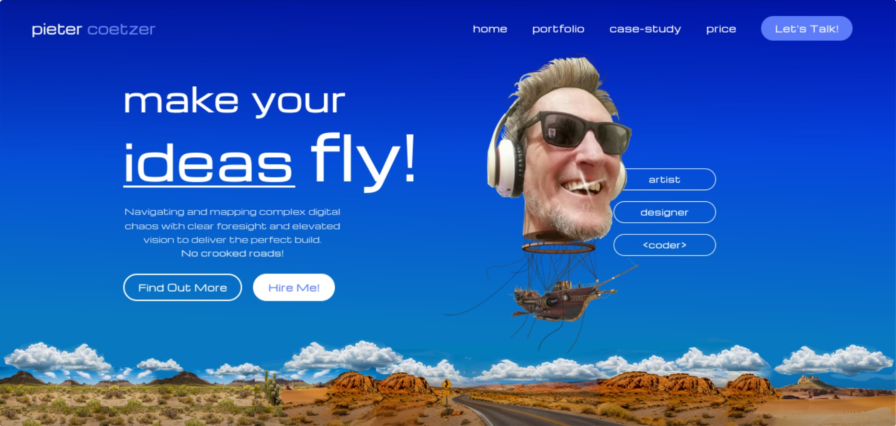

# coetz3r Portfolio

[](https://coetz3r.github.io/portfolio)

A responsive portfolio website showcasing my web development, design work, and professional services.

**Live Website:** https://coetz3r.github.io/portfolio

**Repository:** https://github.com/coetz3r/portfolio

---

## Overview

This repository contains the source code for my personal portfolio website.

The website was designed and developed to present my work, highlight featured projects, demonstrate front-end development skills, and provide an easy way for potential clients and employers to learn more about my work.

---

# Front-End & Graphic Design Portfolio

A curated collection of custom web components, interactive 3D viewers, and UI/UX layouts.

## Highlights
- **Interactive 3D Viewers:** Lightweight Three.js product visualizers with custom perspective controls.
- **Mobile Navigation:** Off-canvas slide-and-shrink navigation built with zero dependencies.
- **Responsive Architecture:** Pure CSS/JavaScript implementations optimized for fast loading and low overhead.

## Tech Stack
- HTML5 / CSS3 (3D Transforms, Custom Properties)
- JavaScript (Vanilla ES6+)
- Three.js

---

## Features

- Responsive layout
- Custom slide-and-shrink mobile navigation
- Modern user interface
- Project and case study pages
- Optimized images and assets
- Clean HTML, CSS and JavaScript structure

---

## Development

This project is developed and maintained as an ongoing portfolio project. 
The repository contains the working source code and documents the continued 
development, refinement, and maintenance of the website.

---

## Repository Structure

```text
assets/
├── css/
├── img/
├── js/

components/

case-studies/

index.html
README.md
LICENSE
```

---

## Design Goals

- Fast loading
- Mobile-first experience
- Accessible navigation
- Maintainable code structure
- Modern responsive design

---

## License

Copyright © 2026 Pieter Coetzer

All Rights Reserved.

This repository is published for portfolio and evaluation purposes only.

The source code, design, JavaScript, CSS, graphics, branding, written content, and all other project assets may not be copied, modified, redistributed, or incorporated into another project without prior written permission.
